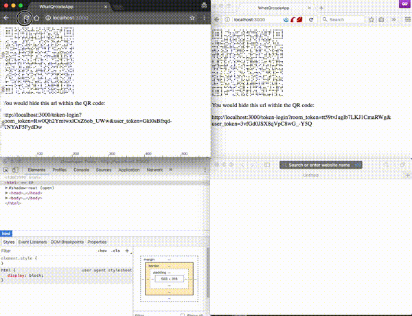

This application was in response to this StackOverflow question:

- [ruby on rails - How can I implement Whatsapp life QR code authentication - Stack Overflow](http://stackoverflow.com/questions/42879668/how-can-i-implement-whatsapp-life-qr-code-authentication/42881593#42881593)

# A demonstration of what this application does

This application allows an User to send a POST request to login an User from an
external application (like a mobile app or external service) within the browser
they are looking at. However, for demonstration purposes it is a GET request,
and the external API token that would be used as well as generated with an
external service or mobile application is attached to submitted URL, when it
should appended somewhere else in order to properly authenticate.

_The QRCode is used to hide the presented URL that is displayed in this example
application._

# README

This README would normally document whatever steps are necessary to get the
application up and running.

Things you may want to cover:

* Ruby version

    2.4.0

* System dependencies

    Redis (in Production)

* Configuration

* Database creation

_This example application is using SQLite3, so run:_

    rails db:create

* Database initialization

_This example application is using SQLite3, so run:_

     rails db:migrate db:seed

* How to run the test suite

* Services (job queues, cache servers, search engines, etc.)

* Deployment instructions

* ...
